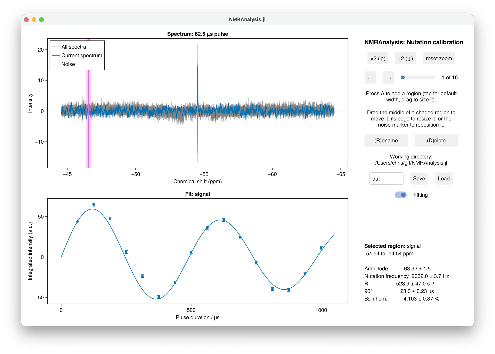

# Pulse Calibration

`calibration1d` analyses a nutation experiment: a series of spectra recorded with
increasing pulse duration, from which the B₁ field strength, the 90° pulse length and the
B₁ inhomogeneity follow. This is how spin-lock powers are calibrated before an R1ρ or CEST
experiment.



## Running the analysis

```julia
using NMRAnalysis

results = calibration1d("1")
```

The [analysis window](overview.md#Using-the-analysis-window) opens with a region on the
tallest peak. Check that it sits over the signal you are calibrating on, put the noise
marker somewhere empty, and press **Save**.

## Calibrating over several power levels

Give several experiments, recorded at different power levels, and each is fitted separately
and the results combined into a calibration curve:

```julia
results = calibration1d(["1", "2", "3"])
```

Each power level appears as its own series in the window, and each contributes its own
nutation frequency and 90° pulse length. The combined result is reported as `nu1ref`, the
field at the reference power `powerref` (the first experiment's), and `linearity`, the
fitted exponent of

```math
\nu_1(p) = \nu_1^\text{ref} \cdot 10^{-L(\text{dB}(p) - \text{dB}(p_\text{ref}))/20}.
```

A linearity `L` of 1 means the amplifier follows the ideal ν₁ ∝ √W. Below 1 the field falls
short of the ideal law as the power is raised, which is the usual signature of amplifier
compression; this is exactly what a single-power calibration cannot see, since it has to
assume `L = 1`.

The power level of each experiment is read from its `calibration.power` annotation, or you
can give them with `power=[-18.0, -12.0, -6.0]`, in dB. A single experiment still
calibrates, reporting the field at its own power with the linearity assumed ideal.

**Save** then writes `calibration.pdf` alongside the usual output: ν₁ against power on a
log axis, where the ideal power law is a straight line, with the fitted curve through the
measurements and the residuals from it underneath in percent. Amplifier compression is a
percent or two and invisible against a decade of field strength, so the residual panel is
where you see it. One power level gets no plot, having no curve to draw.

## Using a calibration in other analyses

`B1Calibration` turns an analysis into the object the exchange analyses take, so that CEST
and R1ρ are simulated with measured field strengths and a measured B₁ inhomogeneity rather
than nominal ones:

```julia
cal = B1Calibration(calibration1d(["1", "2", "3"]))

hz(Power(-15.0, :dB), cal)     # field strength (Hz) at a power you did not calibrate at
Power(2000.0, cal)             # the power to set for a 2 kHz field

exchange1d(["11", "12"]; calibration=cal)
```

The calibration experiments can also be passed directly, in which case they are fitted
without a window opening and their results written to a `calibration/` folder:

```julia
exchange1d(["11", "12"]; calibration=["1", "2", "3"])
setupR1rhopowers(["1", "2", "3"])
```

A calibration fitted on the way to something else is still a measurement and still needs
checking, so it saves what the Save button would have: the fits in `fit.pdf`, the curve in
`calibration.pdf`, the numbers in `summary.txt` and `results.csv`. The analysis that used
it prints it as it starts, and records it in its own saved results.

Without a calibration, each experiment falls back to its own reference pulse (`p1`/`pl1`)
on the assumption of a perfectly linear amplifier, and the B₁ inhomogeneity is taken to be
5%. See [B₁ inhomogeneity](../exchange1d/theory.md) for how the distribution enters the
simulations.

## Durations and modulation

The pulse durations and the modulation are found in the usual
[order of precedence](overview.md#Where-the-parameters-come-from):

| | From an argument | From an annotation | Otherwise |
|---|---|---|---|
| Durations | `durations=[1e-5, 2e-5, …]`, in seconds | `calibration.duration` | you are asked, in µs |
| Modulation | `phase=:sine` or `:cosine` | `calibration.model` | you choose from a menu |

A sine modulation is the usual case, where the experiment starts from equilibrium; a
cosine modulation applies where it starts from transverse magnetisation.

## Pulse programme

An annotated ¹⁹F nutation sequence is available at
[`19f_calib_nut.cw`](https://waudbylab.org/pulseprograms/sequences/19f_calib_nut.cw/). Its
annotations let [`analyse`](../analyse.md) recognise the experiment and run this analysis
without being told which one to use:

```julia
analyse("examples/calibration/1")
```

| Annotation | Meaning |
|---|---|
| `calibration.channel` | Channel being calibrated, e.g. `"f1"` |
| `calibration.power` | Power level used |
| `calibration.duration` | Pulse durations |
| `calibration.model` | `"sine_modulated"` or `"cosine_modulated"` |

## What is fitted

A sinusoid with a Gaussian envelope,

```math
I(t) = A \sin(2\pi \nu t) \exp\left(-\tfrac{1}{2}(2\pi \sigma \nu t)^2\right),
```

or a cosine in place of the sine, from which the 90° pulse length follows as

```math
t_{90} = \frac{1}{4\nu}.
```

The envelope is Gaussian rather than exponential because that is what a Gaussian spread of
B₁ produces: averaging ``\sin(2\pi\nu t)`` over a distribution of ν with mean ν̄ and
standard deviation σν̄ gives ``\sin(2\pi\bar\nu t)\exp(-\tfrac{1}{2}(2\pi\sigma\bar\nu
t)^2)``. Fitting it this way makes σ the width of the B₁ distribution directly, which is
the same quantity the CEST and R1ρ simulations sample. It is fitted, and reported, as a
percentage.

| Parameter | Meaning |
|---|---|
| `A` | Amplitude |
| `nu` | Nutation frequency, Hz |
| `sigma` | Width of the B₁ distribution at this power level, % |
| `power` | Power level, dB (single-power analyses only) |
| `pulse90` | 90° pulse length, µs |
| `inhomogeneity` | B₁ inhomogeneity, %: the smallest `sigma` |
| `powerref`, `nu1ref`, `linearity` | The calibration curve (several power levels only) |

With several power levels, each one's parameters carry its power as a suffix
(`nu_11.11`, `pulse90_11.11`) and are reported together, followed by the calibration
curve.

A B₁ inhomogeneity of 5 to 10% is normal for a standard probe. A much larger value usually
means the fit has gone wrong, or the signal is not on resonance.

Relaxation during the pulse damps the nutation as well, and is not separated from the B₁
spread, so each `sigma` is an upper bound on the inhomogeneity. It is worst at low power,
where the pulses are longest, which is why the reported `inhomogeneity` is the *smallest*
of the estimates when several power levels were measured.

Measuring σ at all needs several periods of nutation: over a single 180° pulse a 5% spread
of B₁ decays the signal by well under a percent. The annotated sequence below runs to a
nominal 720°.

```julia
results = calibration1d("1")
param(results[1], :pulse90)   # µs, with uncertainty
```

## Setting up R1ρ spin-lock powers

`setupR1rhopowers` takes calibration experiments directly and works out the power levels
for a set of spin-lock field strengths:

```julia
setupR1rhopowers("examples/calibration/1")

# several power levels, so the powers follow the fitted curve rather than the ideal law
setupR1rhopowers(["examples/calibration/1", "examples/calibration/2"])
```

Each experiment is fitted in the analysis window first, so you can check the fits before
the powers they imply are pasted into the spectrometer.

See the [R1ρ tutorial](../../tutorials/r1rho.md) for the whole procedure.
