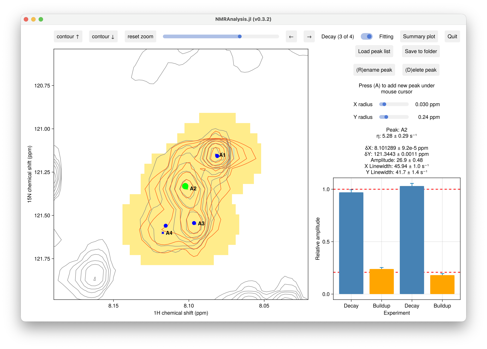
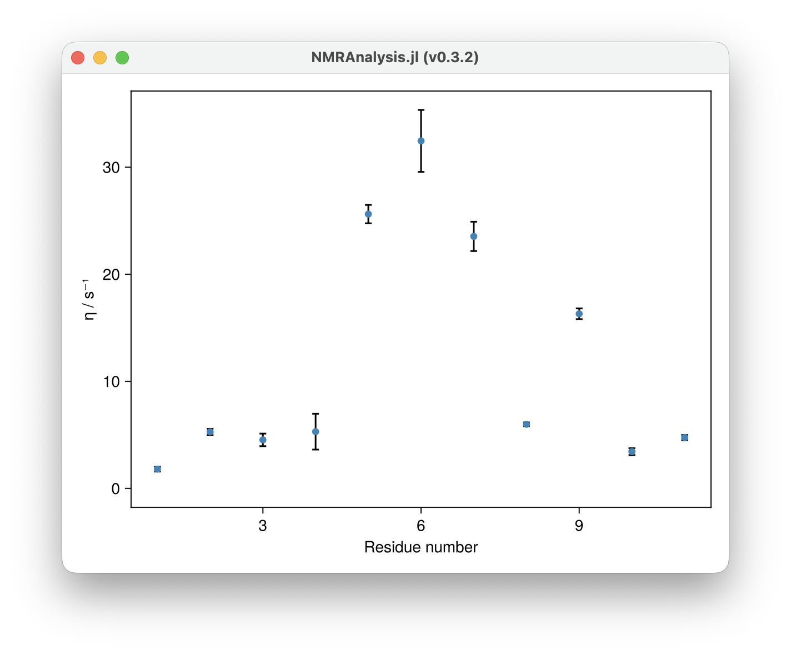

# Cross-Correlated Relaxation (CCR)

Cross-correlated relaxation (CCR) experiments measure the interference between two
relaxation mechanisms — for example, between dipole-dipole coupling and chemical shift
anisotropy — and are used to determine bond vector orientations, order parameters, and
rotational correlation times.

The CCR rate η is extracted by comparing the buildup and decay of spin-state-selective
coherences:

```math
\tanh(\eta T) = \frac{I_\text{buildup}}{I_\text{decay}}
```

For symmetric reconversion experiments, where two buildup and two decay spectra are
recorded to suppress contributions from auto-relaxation:

```math
\tanh(\eta T) = \sqrt{\frac{I_{\text{bu},1} \cdot I_{\text{bu},2}}{I_{\text{dec},1} \cdot I_{\text{dec},2}}}
```



## Usage

### Single decay / buildup pair

```julia
using NMRAnalysis

ccr2d("decay", "buildup", 0.08)
```

### Symmetric reconversion (two pairs)

```julia
ccr2d(
    ["decay1", "decay2"],
    ["buildup1", "buildup2"],
    0.08
)
```

The third argument `T` is the relaxation time constant in seconds during which the CCR
rate acts.

## Output

Clicking **Save to folder** writes all results to `results.csv`. The derived
columns are:

| Column | Description |
|--------|-------------|
| `eta`, `eta_err` | Fitted CCR rate η (s⁻¹) and uncertainty |
| `amp`, `amp_err` | Reference amplitude and uncertainty |

See [Peak Lists and Output Files](peaklistformats.md) for the full format. Plot η
against residue number with `summaryplot("output-folder/")`.

