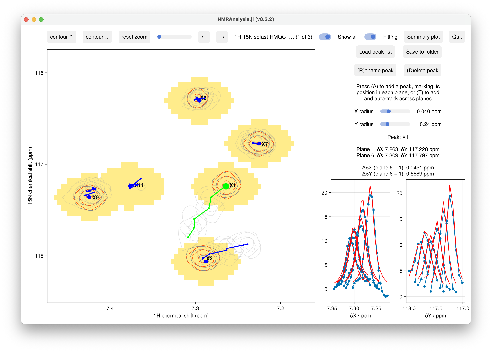

# Moving Peaks

**Moving-peak** analyses track how peak positions (and linewidths) change from plane to plane
— for example across a titration, where peaks walk along a binding trajectory, or a
coupling/RDC measurement (see [Couplings and RDCs](rdc.md)).

```julia
using NMRAnalysis

# A series of 2D spectra in which peaks move (e.g. a titration)
movingfit2d(["11/pdata/1", "12/pdata/1", "13/pdata/1"], [0.0, 0.5, 1.0])
```

- `inputfilenames`: a single pseudo-3D dataset, or a vector of 2D spectra (one per plane).
- The optional second argument gives an independent-variable value per plane (e.g. ligand
  concentration); it defaults to the plane index.

Each peak holds an **independent position, linewidth and amplitude in every plane**, and each
plane is fitted separately. This keeps the fit well-conditioned and decoupled: adjusting one
plane does not disturb the others.



## Adding and positioning peaks

- **(A) — add a peak.** Adding walks through the planes so you mark the peak in each one:
  press `A` with the cursor on the peak in the current plane, then for each subsequent plane
  (stepping forwards and wrapping back to the start) press:
  - `a` to mark the peak's position in that plane and advance,
  - `space` to copy the current position into all remaining planes and finish,
  - `esc` to cancel.

  When at least one peak has already been fitted, new peaks are pre-seeded with the average
  displacement pattern of the fitted peaks, so they inherit the common motion.
- **(T) — add and track.** Drops a peak and follows the intensity maximum across the planes
  automatically (anchored at the current plane, propagated outwards). Best for well-resolved
  peaks; not available for RDC experiments.
- **Drag** a peak's handle to correct its position in the current plane. The handle enlarges
  when hovered. Dragging re-estimates that plane's amplitude.
- **(D)** deletes and **(R)** renames the selected peak, as elsewhere.

## Visualisation

- Each peak's **trajectory** across the planes is drawn as a coloured polyline (red = needs
  fitting, blue = fitted, green = selected).
- The **Show all** toggle overlays every plane's contours faintly, for context when a peak
  moves a long way.

## Output

**Save to folder** writes `results.csv` with each peak's per-plane positions (`x[1]`, `x[2]`,
…), linewidths and amplitudes, and any model-derived parameters. **Load peak list** restores
them, including the fitting radii. The default summary plot shows the combined chemical-shift
perturbation Δδ against residue number, one series per plane.
