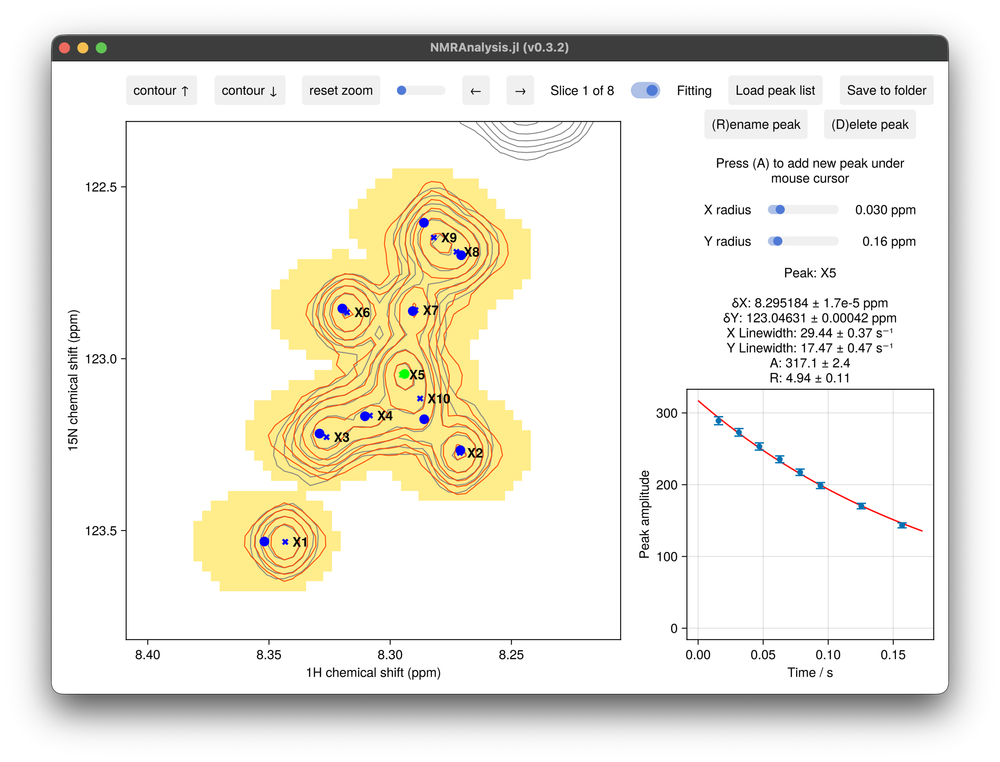

# Relaxation Analysis (T1 / T2)

The `relaxation2d` function measures R1 or R2 relaxation rates from a series of 2D
spectra recorded with increasing relaxation delays. Peak amplitudes are fitted to a
mono-exponential decay:

```math
I(\tau) = A \exp\!\left(-R\tau\right)
```

where ``R`` is the relaxation rate (s⁻¹) and ``A`` is the peak amplitude. The software
does not distinguish between R1 and R2 — the appropriate interpretation depends on the
experiment used to collect the data.



## Usage

```julia
using NMRAnalysis

# Inline relaxation delays (in seconds)
relaxation2d(
    ["11/pdata/1", "12/pdata/1", "13/pdata/1", "14/pdata/1", "15/pdata/1"],
    [0.010, 0.030, 0.060, 0.100, 0.200]
)

# Read delays from a text file (one value per line; lines beginning with # are ignored)
relaxation2d(
    ["11/pdata/1", "12/pdata/1", "13/pdata/1"],
    "vclist.txt"
)

# Omit a specific plane from the fit (e.g. a corrupted or duplicate delay)
relaxation2d(
    ["11/pdata/1", "12/pdata/1", "13/pdata/1", "14/pdata/1", "15/pdata/1"],
    [0.010, 0.030, 0.060, 0.100, 0.200];
    skipplanes=[3]
)
```

The number of input spectra must match the number of relaxation delays.

## Excluding planes from the fit

If one or more planes in the series should not contribute to the fitted rate — for
example because a delay was accidentally repeated, or a spectrum was recorded under
slightly different conditions — pass their 1-based indices via `skipplanes`:

```julia
# CCR buildup experiments often acquire more scans for the first planes;
# ns normalisation handles the amplitude, but a noisy or outlier plane can still
# be excluded:
relaxation2d(files, delays; skipplanes=[1, 5])
```

All spectra are still loaded and displayed. Skipped planes appear as open grey markers
in the peak-fit plot and are labelled **[skipped]** in the slice title; they are not
used when fitting R or A. The full delay list, including times for the skipped planes,
must always be supplied.

## Output

Clicking **Save to folder** writes all results to `results.csv`. Alongside peak
positions, linewidths and the amplitude for each delay, the derived columns are:

| Column | Description |
|--------|-------------|
| `R`, `R_err` | Fitted relaxation rate R (s⁻¹) and uncertainty |
| `A`, `A_err` | Fitted amplitude A and uncertainty |

The rate is labelled generically as `R`; the software does not distinguish R₁
from R₂. See [Peak Lists and Output Files](peaklistformats.md) for the full format.

Plot R against residue number with [`summaryplot`](summary.md). Pass an appropriate
`ylabel` to label the axis for your specific experiment:

```julia
# T2 / R2 measurement
fig = summaryplot(expt; ylabel="R₂ / s⁻¹")
fig = summaryplot("results/"; param=:R, ylabel="R₂ / s⁻¹")

# T1 / R1 measurement
fig = summaryplot(expt; ylabel="R₁ / s⁻¹")
```

## Noise Estimation

Peak amplitude uncertainties are estimated from the scatter of the spectral noise across
the series of experiments.
