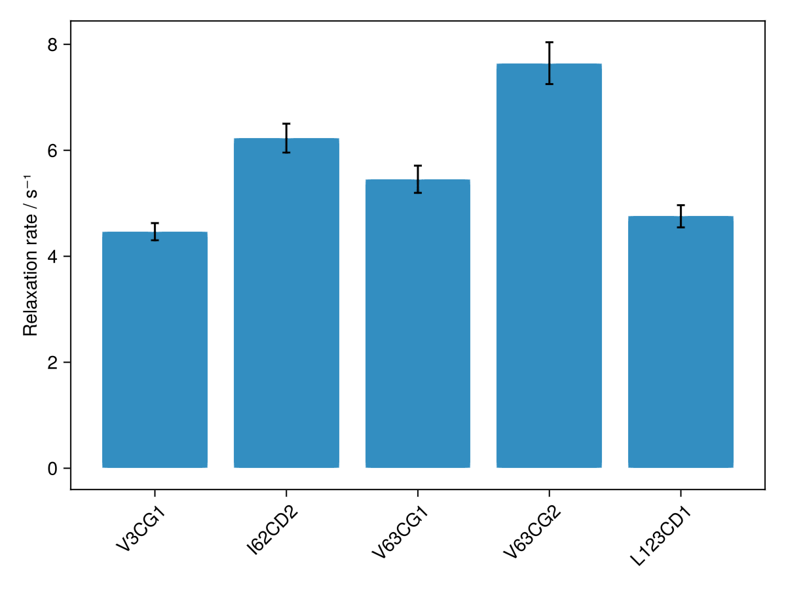

# Summary Plots

`summaryplot` plots a fitted parameter against residue number, from a live
experiment or one or more saved `results.csv` files. It is an ordinary Makie
figure using whichever backend is active, so it is interactive under GLMakie
and can be saved with `save("summary.pdf", fig)` under CairoMakie.



## Basic usage

```julia
fig = summaryplot("run1/results.csv")            # from a saved file
fig = summaryplot("run1/")                       # folder containing results.csv
```

## Saving plots

Summary figures can be saved as publication-quality pdfs using CairoMakie:

```julia
using CairoMakie
fig = summaryplot("my-analysis-output/")
save("summaryplot.pdf", fig)
```


## Y-axis labels

Each parameter has a built-in default label (for example `:hetnoe` → "Heteronuclear NOE",
`:eta` → "η / s⁻¹"). For the generic relaxation rate `:R` — used by `relaxation2d`,
which makes no assumption about whether you measured R₁ or R₂ — you should supply the
appropriate label explicitly:

```julia
fig = summaryplot(expt; ylabel="R₂ / s⁻¹")
fig = summaryplot("results/"; param=:R, ylabel="R₁ / s⁻¹")
```

## Stacked panels

Passing multiple sources (as a vector or as separate arguments) produces vertically
stacked panels, one per source. By default each panel uses its own default parameter,
so a mix of experiment types — relaxation and hetNOE, for example — each show their
own result automatically:

```julia
# Two sources as separate arguments
fig = summaryplot("r2/", "r1/", "noe/")

# Or equivalently as a vector
fig = summaryplot(["r2/", "r1/", "noe/"])

# Per-panel y-axis labels
fig = summaryplot("r2/", "r1/", "noe/";
                  param=[:R, :R, :hetnoe],
                  ylabel=["R₂ / s⁻¹", "R₁ / s⁻¹", "Heteronuclear NOE"])

# Same parameter across all panels (e.g. comparing WT vs mutant R₂)
fig = summaryplot("wt/", "mutant/"; param=:R, ylabel="R₂ / s⁻¹")
```

## Plot style

- **Backbone/amide peaks** (labels such as `A10N`, `G23HN`) → scatter of value
  vs residue number with error bars.
- **Atom-typed peaks** (e.g. methyls `I13CD1`, `L26CD2`) → bar chart ordered by
  `(residue, atom)` with peak-label ticks, so stereospecific pairs do not overlap.
  The style is chosen automatically per panel.
- Unassigned peaks (default `X#` names) are omitted unless every peak is
  unassigned, or `include_unassigned=true` is passed.

## Figure size

Pass `size=(width, height)` (in pixels) to control the figure dimensions:

```julia
fig = summaryplot(expt; size=(800, 400))
fig = summaryplot("r2/", "r1/", "noe/"; size=(800, 900))
```

## Parameter selection (advanced)

By default each source plots its own primary parameter (the first derived column in
`results.csv`, or the experiment's `primaryparam`). To plot a different column, pass
its name as a `Symbol` — the column header in `results.csv` with a colon prefix:

```julia
# Parameter :R20 corresponds to the column headed "R20" in results.csv
fig = summaryplot("cpmg/"; param=:R20)

# Amplitude from the first plane
fig = summaryplot("fit2d/"; param=Symbol("amp[1]"))
```

Symbols in Julia are formed with a leading colon: `:R`, `:hetnoe`, `:eta`, `:PRE`.
For column names that contain brackets or other special characters (such as `amp[1]`),
use `Symbol("amp[1]")`. To see which parameters are available from a file or live
experiment, call `available_params`:

```julia
available_params("results/results.csv")   # → [:R, :A, :amp_1, ...]
available_params(expt)                    # → [:R2, :hetnoe, ...]
```

For stacked panels, `param` and `ylabel` may each be a vector with one entry per source;
use `nothing` in a vector position to fall back to that source's default:

```julia
fig = summaryplot(["relax/", "noe/"]; param=[:R, nothing], ylabel=["R₂ / s⁻¹", nothing])
```
