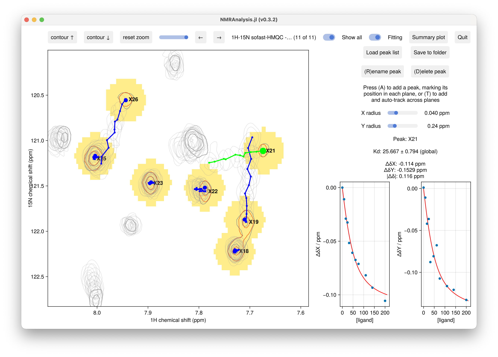

# Titrations

`titration2d` analyses a 2D titration series, fitting a **global binding isotherm** to the
chemical-shift perturbations. It is a [peak-tracking](peaktracking.md) analysis: each residue's
peak walks along a binding trajectory across the planes, and the fit recovers a single
dissociation constant ``K_\text{d}`` (shared by all residues) together with the free and bound
chemical shifts of every residue in each dimension.

```julia
using NMRAnalysis

files = [
    "/Users/chris/git/titan/examples/FBPNbox/1"
    "/Users/chris/git/titan/examples/FBPNbox/2"
    "/Users/chris/git/titan/examples/FBPNbox/3"
    "/Users/chris/git/titan/examples/FBPNbox/4"
    "/Users/chris/git/titan/examples/FBPNbox/5"
    "/Users/chris/git/titan/examples/FBPNbox/6"
    "/Users/chris/git/titan/examples/FBPNbox/7"
    "/Users/chris/git/titan/examples/FBPNbox/8"
    "/Users/chris/git/titan/examples/FBPNbox/9"
    "/Users/chris/git/titan/examples/FBPNbox/10"
    "/Users/chris/git/titan/examples/FBPNbox/11"
]
ligand_concs = [0, 8.13, 16.14, 24.01, 31.76, 46.89, 61.56, 75.79, 109.53, 140.89, 200.06]
protein_concs = [41, 40.67, 40.34, 40.02, 39.7, 39.08, 38.48, 37.89, 36.51, 35.22, 32.8]

# Ligand concentrations only (hyperbolic, ligand ≈ free):
titration2d(files, L0=ligand_concs)

# With protein concentrations — exact 1:1 equation, accounts for dilution:
titration2d(files, L0=ligand_concs, P0=protein_concs)
```



## Arguments

- `inputfilenames`: a single pseudo-3D dataset, or a vector of 2D spectra (one per plane).
- `L0`: total **ligand** concentration in each plane (one value per plane).
- `P0`: total **protein** concentration in each plane (one value per plane), or omitted. When
  supplied, the exact 1:1 binding equation is used, which accounts for the protein concentration
  and any dilution during the titration.
- `weights`: `(wx, wy)`, the per-dimension weighting used to combine the x and y shift changes
  into the single `|Δδ|` reported in the summary plot (see [Combined CSP](#Combined-CSP)). This
  affects **only** the combined `|Δδ|` summary; the per-dimension panels and the `Kd` fit do not
  use it. The default `(1.0, 0.14)` assumes ¹H on the x (F1) axis and ¹⁵N on the y (F2) axis.

!!! note "Concentration units"
    Use whatever concentration units you like for `L0` and `P0` (µM, mM, …), as long as both are
    in the **same** units. The fitted ``K_\text{d}`` is reported in those same units.

## Tracking peaks

Peaks are added and positioned exactly as in [peak tracking](peaktracking.md):

- **(T) — add and track** drops a peak and follows the intensity maximum across the planes
  automatically. Best for well-resolved titrations.
- **(A) — add** walks through the planes so you mark the peak in each one by hand, for crowded
  regions.
- **Drag** a peak's handle to correct its position in the current plane; **(D)** deletes and
  **(R)** renames the selected peak.

Use assigned peak labels containing a residue number (e.g. `L23`) so the summary plot can place
each point against residue number.

## The binding model

Binding is treated as a single-site (1:1) interaction ``P + L \rightleftharpoons PL`` with
dissociation constant

```math
K_\text{d} = \frac{[P][L]}{[PL]}.
```

In each plane the observed shift is a population-weighted average of the free and bound states,
so the perturbation relative to the free shift is

```math
\Delta\delta = f \,(\delta_\text{bound} - \delta_\text{free}),
```

where ``f = [PL]/P_\text{T}`` is the fraction of protein bound and ``P_\text{T}`` is the total
protein concentration. How ``f`` is computed depends on whether protein concentrations are
provided.

**With ligand concentrations only** (`L0`), the free ligand is approximated by the total
ligand (``[L] \approx L_\text{T}``), giving the hyperbolic isotherm

```math
f = \frac{L_\text{T}}{K_\text{d} + L_\text{T}}.
```

**With protein concentrations** (`L0` and `P0`), the exact 1:1 quadratic is solved for each
plane (no free-ligand approximation), which accounts for ligand depletion and for dilution of
the protein as titrant is added:

```math
[PL] = \tfrac{1}{2}\left(P_\text{T} + L_\text{T} + K_\text{d}
       - \sqrt{(P_\text{T} + L_\text{T} + K_\text{d})^2 - 4\,P_\text{T} L_\text{T}}\right),
\qquad f = \frac{[PL]}{P_\text{T}}.
```

The two forms agree in the ``P_\text{T} \to 0`` limit.

The fit has a single nonlinear parameter — the shared ``K_\text{d}``. For any trial
``K_\text{d}`` the per-residue, per-dimension free and bound shifts (``\delta_\text{free}``,
``\delta_\text{bound}``) follow from a weighted linear regression of the fitted positions on the
bound fraction ``f`` (variable projection), with weights taken from the per-plane position
uncertainties. ``K_\text{d}`` is then optimised over this 1-D problem, and its uncertainty is
obtained by the delta method.

## Results

- The **per-residue panel** shows ΔδX and ΔδN against ligand concentration (referenced to the
  fitted ``\delta_\text{free}``), with the fitted binding curve overlaid.
- The global ``K_\text{d}`` (± uncertainty) is reported in the results panel, in the same
  concentration units as `L0`/`P0`.
- **Save to folder** writes `results.csv` with each peak's per-plane positions, linewidths and
  amplitudes, plus the derived ``\delta_\text{free}``/``\delta_\text{bound}`` shifts and the
  global ``K_\text{d}``. **Load peak list** restores them.
- The **summary plot** shows ΔδX, ΔδN and the combined `|Δδ|` (saturation CSP =
  ``\delta_\text{bound} - \delta_\text{free}``) against residue number.

## Combined CSP

The summary plot's combined chemical-shift perturbation merges the saturation shift changes in
the two dimensions into a single per-residue value, using the weighted Euclidean combination of
Williamson (2013):

```math
|\Delta\delta| = \sqrt{(w_x\,\Delta\delta_x)^2 + (w_y\,\Delta\delta_y)^2},
```

where ``\Delta\delta_x`` and ``\Delta\delta_y`` are the bound − free shift changes in each
dimension and ``(w_x, w_y)`` are set by the `weights` argument. The weights put the two nuclei on
a comparable scale: the much larger ¹⁵N shift range would otherwise dominate a ¹H change of the
same nominal size. The default `(1.0, 0.14)` is appropriate for a ¹H/¹⁵N spectrum; for ¹H/¹³C
use roughly `(1.0, 0.25)`. The weighting is applied only here — the per-dimension ΔδX/ΔδN panels
and the global ``K_\text{d}`` fit are independent of it.
