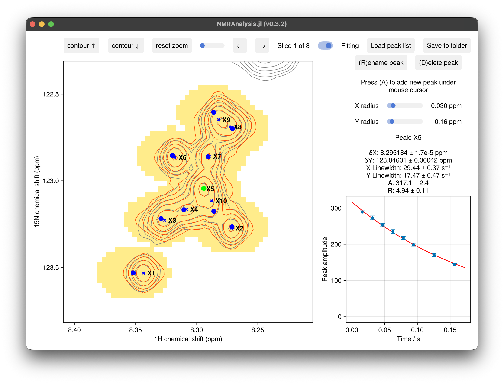

# NMRAnalysis.jl

NMRAnalysis.jl is a Julia package for analysing biomolecular NMR relaxation, diffusion,
exchange, and dynamics experiments. It is aimed at NMR spectroscopists, not necessarily
experienced Julia programmers: each experiment type is handled by a single function that
takes you from processed spectra to a fitted result through an interactive graphical
interface, where regions or peaks are picked with the mouse and fits update as you work.

This documentation assumes that you have Julia installed, that you have processed
Bruker-format spectra ready to analyse, and that you have some familiarity with the NMR
experiment you want to analyse, since NMRAnalysis.jl fits your data to established
relaxation, diffusion, or exchange models rather than choosing one for you. If any of
that doesn't apply yet, start with the [Quick Start](quickstart.md) guide.

!!! note "Active development"
    NMRAnalysis.jl is under active development. Features and API may change as the
    package evolves.

## 1D Experiments

Routine 1D experiments, including relaxation, diffusion, TRACT, pulse calibration and
kinetics, are each handled by a single function called from the Julia REPL. Each asks for
whatever it cannot read from the data, then opens a window in which you position the
integration region over your signal and watch the fit follow. Chemical exchange has its
own routines: an interactive R1ρ dispersion GUI, and a joint CEST/R1ρ/R1
Bloch-McConnell fit. See [1D Experiments](analyses/1d/overview.md) for the full set, or
follow the [Quick Start](quickstart.md) for a first example.

## 2D Experiments

2D and pseudo-3D experiments, including relaxation, exchange, NOE, RDCs, and titrations,
are handled through a shared interactive GUI: pick peaks with the mouse, watch lineshapes
and model fits update in real time, and export results to a folder. See the
[2D Overview](analyses/2d/overview.md) for a tour of the interface and the full list of
supported experiment types.

## Tutorials

Worked, step-by-step examples are collected under [Tutorials](tutorials/r1rho.md),
starting with a full ¹⁹F R1ρ acquisition and analysis walkthrough.

## Ecosystem

NMRAnalysis.jl is part of a suite of Julia packages for NMR data handling developed by
the [Waudby lab](https://waudbylab.org). See [Ecosystem](ecosystem.md) for the related
packages and how they fit together.

## Contributing

NMRAnalysis.jl is developed and maintained by the
[Waudby lab](https://waudbylab.org) at University College London.
Contributions are warmly welcomed — whether that's bug reports, new analysis
routines, documentation improvements, or example datasets. Please open an issue
or pull request on [GitHub](https://github.com/waudbylab/NMRAnalysis.jl).
